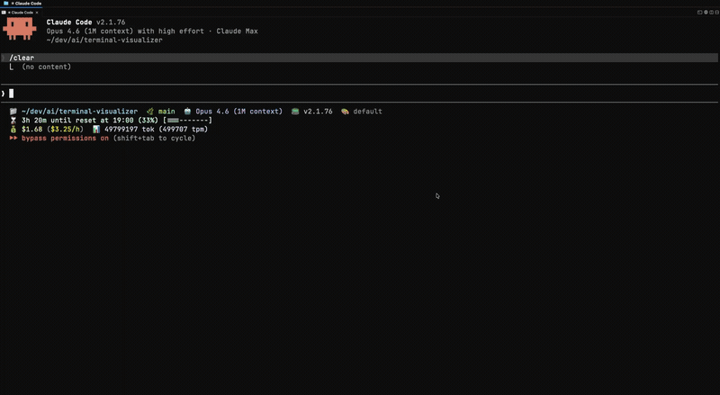

# Terminal Visualizer

Interactive terminal visualizations for Claude Code. Pipe JSON, get a pixel-perfect interactive viewer in a split pane. No MCP server — just a CLI tool + Claude Code skill.



## Install

```bash
curl -fsSL https://raw.githubusercontent.com/gocodeweb/terminal-visualizer/main/install.sh | bash
terminal-visualizer install-skill    # register skill for Claude Code, Cursor, Codex & more

# Or install the skill directly without the CLI:
npx skills add gocodeweb/terminal-visualizer
```

## Usage

Claude Code automatically uses the skill to visualize data. You can also invoke directly:

```bash
# Interactive (opens split pane viewer)
terminal-visualizer <<'EOF'
{"type": "heatmap", "title": "Commits", "xLabels": ["Mon","Tue","Wed"], "yLabels": ["9am","12pm","5pm"], "data": [[5,12,8],[2,18,6],[7,4,15]], "colorRamp": "green"}
EOF

# Static image (inline in terminal)
terminal-visualizer --static < data.json

# From a file
terminal-visualizer --file visualization.json
```

## Rendering Backends

Auto-detects the best backend for your terminal:

| Terminal | Backend | Quality |
|----------|---------|---------|
| **Ghostty / cmux** | Kitty graphics (SVG→PNG) | Pixel-perfect |
| **Kitty** | Kitty graphics (SVG→PNG) | Pixel-perfect |
| **WezTerm** | Kitty graphics (SVG→PNG) | Pixel-perfect |
| **Konsole / Rio** | Kitty graphics (SVG→PNG) | Pixel-perfect |
| **iTerm2** | Ink (React for CLI) | Rich text + Unicode |
| **VS Code / Alacritty** | Ink (React for CLI) | Rich text + Unicode |
| **Other** | Blessed TUI | ASCII art fallback |

Split pane support:

| Environment | Method |
|-------------|--------|
| **cmux** (Ghostty) | `cmux new-split right` |
| **tmux** | `tmux split-window -h` |
| **Other** | `/dev/tty` overlay |

## 10 Visualization Types

| Type | Use case |
|------|----------|
| **bar-chart** | Distribution, ranking, comparisons |
| **line-chart** | Trends, time series |
| **flow-diagram** | Architecture, pipelines, data flows |
| **tree** | Hierarchies, component structures |
| **table** | Comparisons, data grids |
| **grid** | Periodic tables, keyboard layouts, game boards |
| **timeline** | Gantt charts, project roadmaps |
| **heatmap** | Commit activity, correlation matrices |
| **stacked-bar-chart** | Composition breakdowns |
| **sequence-diagram** | API flows, protocol exchanges |

See `SKILL.md` for full JSON schemas and examples.

## How It Works

```
Claude Code → Bash tool → terminal-visualizer <<'EOF' ... EOF
                              ↓
                  Auto-detect terminal capabilities
                              ↓
              ┌─── Kitty? → SVG→PNG pixel graphics
              │              Worker thread pre-renders all frames
              │              Instant navigation
              │
              └─── Other → Ink (React) or Blessed text UI
                              ↓
              Opens in split pane (cmux/tmux)
              User navigates with arrow keys
              Enter to select, q to quit
                              ↓
              Selection returned as Bash output
              Claude reads it and can drill deeper
```

## CLI Reference

```
terminal-visualizer <<'EOF'    # pipe JSON via heredoc
terminal-visualizer --file f   # read from file
terminal-visualizer --static   # render inline image, no interaction
terminal-visualizer --json     # output selection as JSON
terminal-visualizer install-skill  # register Claude Code skill
terminal-visualizer --help
terminal-visualizer --version
```

Aliases: `viz` (shorthand for `terminal-visualizer`)

## Architecture

```
terminal-visualizer/
├── src/
│   ├── cli.ts                    # CLI entrypoint
│   ├── viewer.ts                 # Viewer (Kitty pixel or Ink fallback)
│   ├── render-worker.ts          # Worker thread for SVG→PNG pre-rendering
│   ├── types.ts                  # 10 visualization type definitions
│   ├── tui/
│   │   ├── screen.ts             # Split pane orchestration (cmux/tmux/tty)
│   │   ├── kitty-viewer.ts       # Kitty pixel viewer
│   │   ├── render-*.ts           # 10 blessed TUI fallback renderers
│   │   └── theme.ts              # 9-color ramp
│   ├── ink/
│   │   ├── InkViewer.tsx         # Main Ink app
│   │   ├── Ink*.tsx              # 10 Ink React components
│   │   └── theme.ts
│   └── image/
│       ├── svg-renderer.ts       # SVG generation + highlight
│       ├── kitty-renderer.ts     # Kitty protocol + resvg-js
│       └── terminal-image.ts     # iTerm2/Kitty/Sixel protocols
├── SKILL.md                        # Claude Code skill definition
├── CLAUDE.md
└── package.json
```
