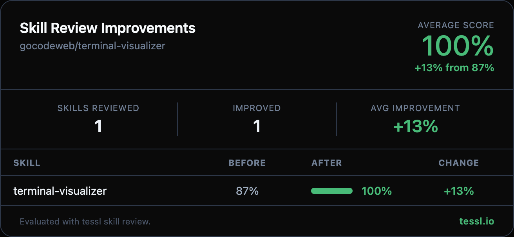

Hey @eladcandroid 👋

I ran your skills through `tessl skill review` at work and found some targeted improvements. Here's the full before/after:

| Skill | Before | After | Change |
|-------|--------|-------|--------|
| terminal-visualizer | 87% | 100% | +13% |

Changes made

**Description (90% → 100%)**
- Added specific visualization types (bar charts, line charts, flow diagrams, etc.) to the frontmatter description to improve specificity — the judge flagged that the original named the domain but didn't list concrete capabilities

**Content (80% → 100%)**
- Restructured "How to Invoke" into a clear 5-step numbered workflow with explicit prerequisite validation, invocation, output handling, and error recovery steps — this addressed the workflow clarity gap
- Extracted 7 less-common visualization type schemas into a new `TYPES.md` reference file, keeping the 3 most common types (bar-chart, flow-diagram, table) inline — improves progressive disclosure so the skill stays scannable while full schemas remain accessible
- Removed redundant "Prerequisites" section (now covered in workflow step 1)

Honest disclosure — I work at @tesslio where we build tooling around skills like these. Not a pitch - just saw room for improvement and wanted to contribute.

Want to self-improve your skills? Just point your agent (Claude Code, Codex, etc.) at [this Tessl guide](https://docs.tessl.io/evaluate/optimize-a-skill-using-best-practices) and ask it to optimize your skill. Ping me - [@yogesh-tessl](https://github.com/yogesh-tessl) - if you hit any snags.

Thanks in advance 🙏
